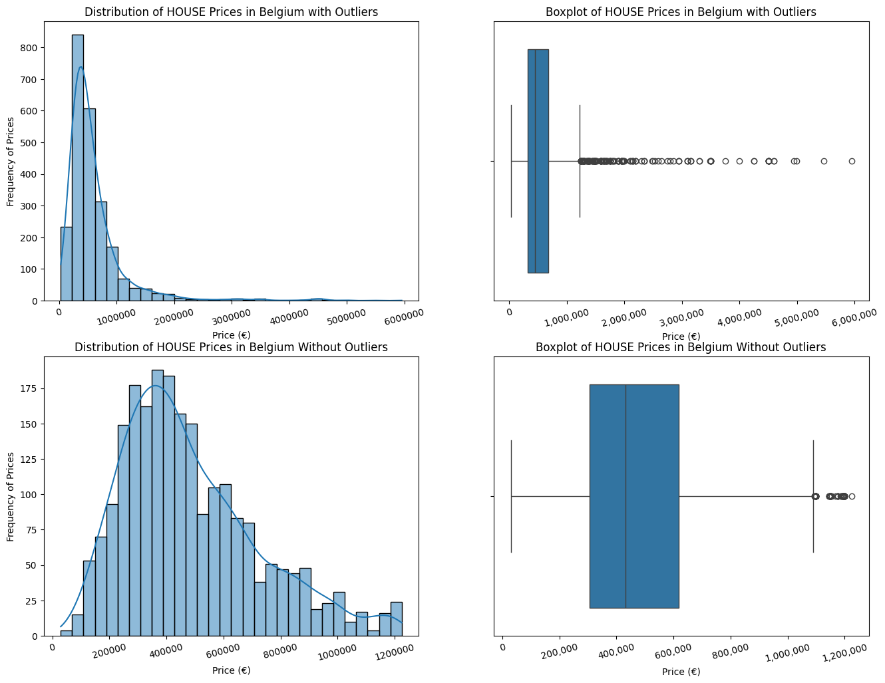
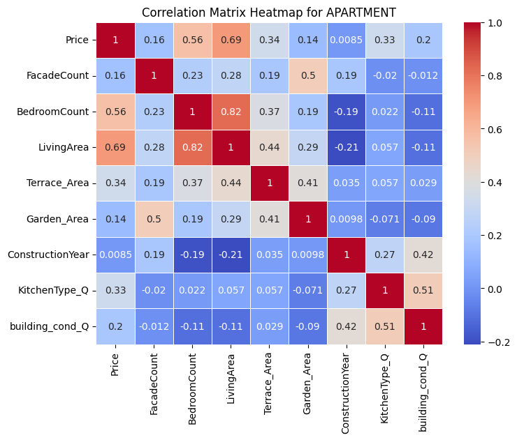
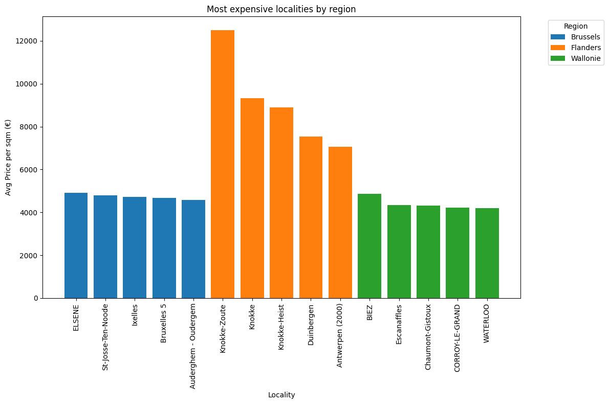

# Churn Prediction


## 📝 Description
This project focuses on helping Immo Eliza, a real estate company, predict property prices throughout Belgium. By analyzing a dataset with property information, the goal is to uncover key insights about the Belgian real estate market and determine the factors that most influence property prices. The project includes steps like data cleaning, exploratory analysis, and visualization to extract meaningful findings.


## 📈 Objective
- Analyze a dataset of property details to uncover insights into the Belgian real estate market.
- Identify key factors influencing property pricing.
- Perform data cleaning, exploratory analysis, and visualization.
- Provide actionable recommendations through clear visualizations and insights.


## 📦 Repo Structure
```
├── Data
│   ├── BELGIUM_Provinces
│   ├── Brussels_Municipalities
│   ├── properties_cleaned.csv
│   └── properties.csv
├── assets
├── Notebooks
│   ├── Cleaning.ipynb
│   ├── Exploratory Data Analysis.ipynb
│   ├── Heat_map.ipynb
│   ├── Maps_average prices_example.ipynb
│   └── Outliers removal.ipynb
├── Results
│   ├── Belgium_average_prices_maps
│   ├── Data_after_outliers_removal
│   │   ├── APARTMENT_without_outliers.csv
│   │   ├── HOUSE_without_outliers.csv
│   │   └── Houses_and_Apartments_combined_without_outliers.csv
│   ├── Graphs
│   │   ├── APARTMENT_price_distribution.png
│   │   ├── cheapest_localities.png
│   │   ├── HOUSE_price_distribution.png
│   │   └── most_expensive_localities.png
│   └── Heat_Maps
│       ├── Correlation Matrix Heatmap for ALL Properties.png
│       ├── Correlation Matrix Heatmap for APARTMENT.png
│       ├── Correlation Matrix Heatmap for HOUSE.png
│       ├── Correlation Matrix Heatmap for houses and apartments in Brussels.png
│       ├── Correlation Matrix Heatmap for houses and apartments in Flanders.png
│       └── Correlation Matrix Heatmap for houses and apartments in Wallonie.png
├── .gitignore
├── Average_prices_maps.py
├── cleaning.py
├── Exploratory_Data_Analysis.py
├── Heat_maps.py
├── main.py
├── README.md
├── removing_outliers.py
└── requirements.txt
```
## 🗃️ Data Sources
The dataset used for this project has been scraped previously from Immoweb website:
[Immoweb](https://www.immoweb.be/en)

## 🛠️ Installation
```
  1. Clone the repository to your local machine.

    ```
    git clone https://github.com/MoustafaGabil/immo-eliza-analysis.git
    ```

  2. Navigate to the project directory and install the required dependencies:

    ```
    pip install -r requirements.txt
    ```
  ```


### Prerequisites
- Python 3.8 or higher
- Recommended packages:
  - `pandas`
  - `numpy`
  - `matplotlib`
  - `seaborn`
  - `jupyter`

## 💻 Usage
1. Launch Jupyter Notebook:
   ```bash
   jupyter notebook
   ```
2. Open the 5 notebooks in this order:
- `Cleaning.ipynb`
- `Outliers removal.ipynb`
- `Exploratory Data Analysis.ipynb`
- `Heat_map.ipynb`
- `Maps_average prices_example.ipynb`

# OR
`You can directly run the main.py file`
## 📈 Data Analysis
### Observations and features
- There were 5752 rows (observations) and 32 columns (features).
- Here is the table of columns with more than 20% missing values in original dataset:

'''
| Column           | Missing percentage |
| -------------    | -------------      |
| Garden_Area      | 82.00              |
| Terrace_Area     | 55.72              |
| LandSurface      | 53.23              |
| LandWidth        | 53.23              |
| FloorCount       | 40.38              |
| ConstructionYear | 32.01              |
| KitchenType      | 30.81              |
| FacadeCount      | 27.14              |
| StateBuilding    | 22.47              |

''' 
### Columns to be deleted
We could delete these columns: Open_fire, TypeSale, PriceType, LifeAnnuitySale, Swimming_pool because only 5% of properties have an open fire, while 95% do not; less than 2% of properties have a swimming pool and only 3% of properties are furnished, indicating this is a rare feature.

## 📊 Visuals

### Comparing Between Distribution before and after removing the outliers based on the IQR technique for Houses.


### Features Correlation

### Correlation Summary Table

|                                    | Houses and Apartment | Houses   | Apartment |
|------------------------------------|----------------------|----------|-----------|
| Price & Bedrooms number            | Moderate             | Weak     | Moderate  |
| Price & Living area                | Moderate             | Moderate | Strong    |
| Bedrooms number & Living area      | Very Strong          | Strong   | Strong    |
| Building condition & kitchen type  | Moderate             | Moderate | Moderate  |

### Most expensive localities over Belgium


### Average Apartments' prices distrubution over belgium per region


### Average Houses' prices distrubution over Brussels per locality


#### For additional graphs and detailed insights, please visit the repository.

## ⏱️ Timeline
This project was done in 5 days including studying the theory and implementing the code.

## 📌 Context  
This project was developed as part of the **AI training program** at **BeCode Academy**, providing hands-on experience in SQL and data analysis.

## 🌐 Connect Me!
Special thanks to our mentor and the entire team for their dedication and collaboration throughout this project.

  **Moustafa Gabil**  
  [](https://www.linkedin.com/in/moustafa-gabil-8a4a6bab/)  
 